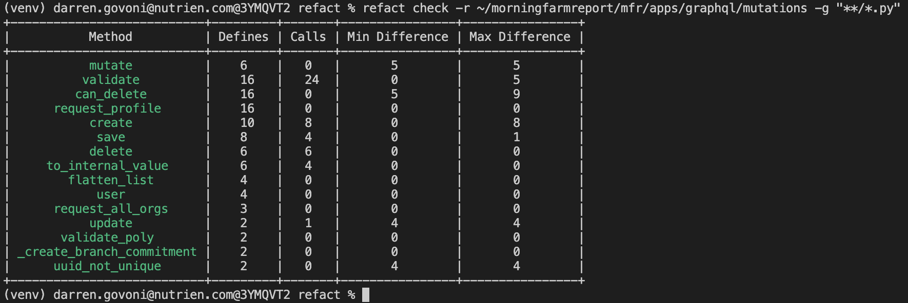
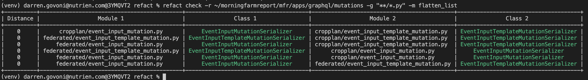
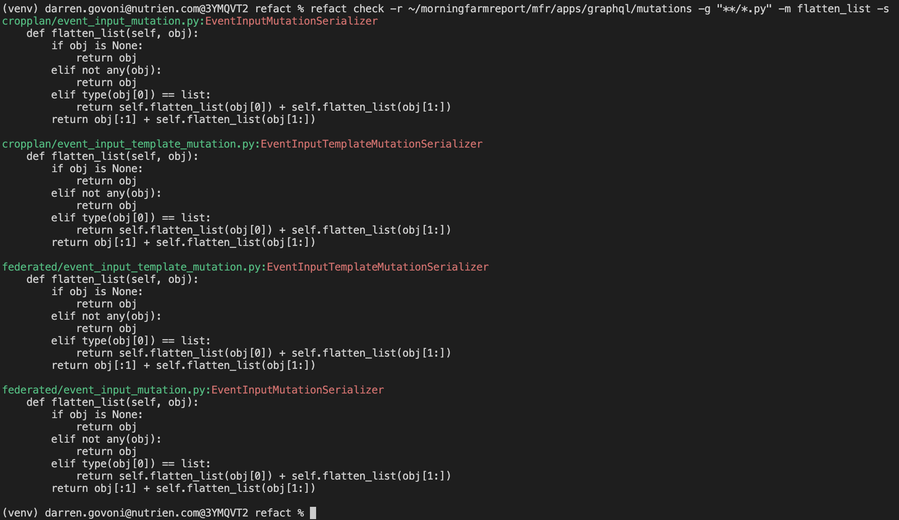

# refact
Python refactoring assist CLI

## Installation
```bash
$ git clone https://github.com/cronusone/refact
$ cd refact
$ make install
$ source venv/bin/activate
```
## Overview
`refact` is a novel command line tool for discovering where class methods have been duplicated, copy/pasted or have deivated from other versions. The point of this would be to refactor redundant class methods into shared code as mixins, singletons or other patterns.

## Usage

```bash
(venv) $ refact
Usage: refact [OPTIONS] COMMAND [ARGS]...

Options:
  --debug  Debug switch
  --help   Show this message and exit.

Commands:
  check  Check for code duplications and refactor opportunities

(venv) $ refact check --help
Usage: refact check [OPTIONS]

  Check for code duplications and refactor opportunities

Options:
  -r, --root TEXT         Source directory root  [required]
  -d, --distance INTEGER  Levenshtein distance threshhold
  -g, --glob TEXT         Glob pattern of files to check  [required]
  -m, --method TEXT       Analyze a specific method
  -s, --source            Show the source code only
  --help                  Show this message and exit.
(venv) $ 

```


Finding method definitions and usage calls within modules and compare the max and min differences among them.

```bash
$ refact check -r ~/morningfarmreport/mfr/apps/graphql/mutations -g "**/*.py"
```


```bash
$ refact check -r ~/morningfarmreport/mfr/apps/graphql/mutations -g "**/*.py" -m flatten_list  
```


```bash
$ refact check -r ~/morningfarmreport/mfr/apps/graphql/mutations -g "**/*.py" -m flatten_list -s
```

